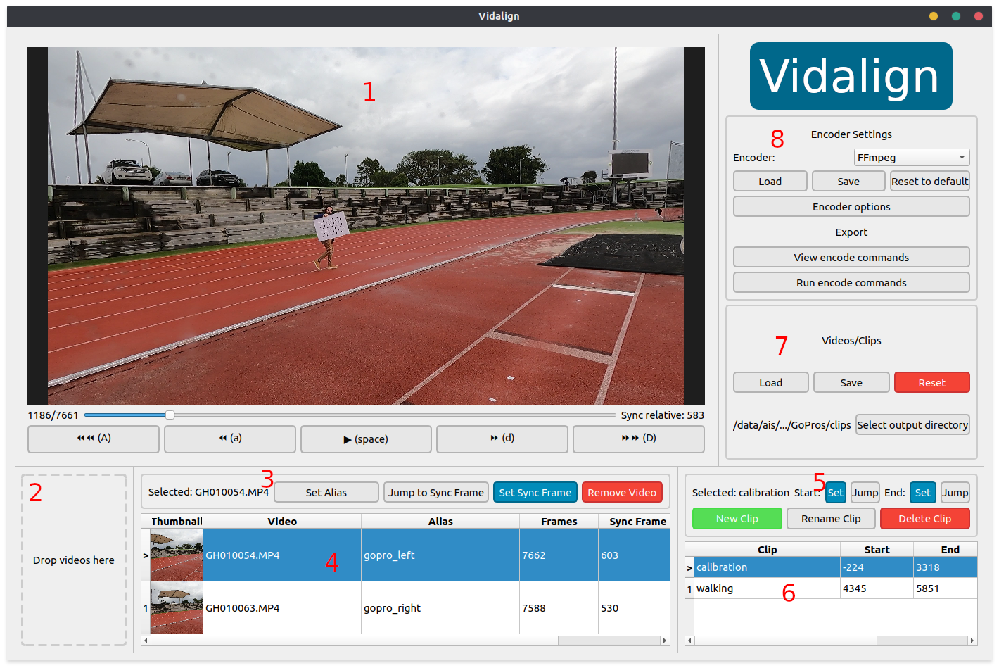

# VidAlign

A tool to perform multi-camera video temporal alignment and clip extraction.

## Installation

```bash
conda env create -f environment.yml;
conda activate vidalign;
```

## Usage

```bash
python vidalign/main.py;
```

### Overview



1. **Video Player**: Basic video playback and frame seeking, with support for panning and zooming using the mouse. Take note of the keyboard shortcuts on the playback buttons, as they'll be your best friend.
2. **Video Dropper**: Drop video files and folders here to import them. Directories will be descended recursively looking for video files. At the time of writing the supported extensions are: `{mp4, avi, mkv, mov, mxf}`.
3. **Video Info**: Information about the currently selected video, with buttons to set metadata. See [workflow](#workflow) below for more detail.
4. **Video List**: List of imported videos. If there are no empty cells here, you've done what's needed for the videos. _Ensure you don't set the same alias for multiple videos!_
5. **Clip Info**: Information about the currently selected clip, with buttons to set the start and end frames, and other useful things. See [workflow](#workflow) below for more detail.
6. **Clip List**: List of clips videos. If there are no empty cells here, you've done what's needed for the clips. _Ensure you don't set the same clip name for multiple clips!_
7. **Video/Clip File Utilities**: Set the output directory for your exported clips, and save/load/reset the videos and clips. Handy if you need to save your progress and return to it later.
8. **Encoder Settings**: Here you can choose your encoder application (just FFmpeg at this point), configure some of the encoding parameters, and save/load/reset them. If you figure out parameters that you like, export them and load them at the start of each session.

### Workflow

1. Load some videos by dragging them onto the video dropper.
1. For each video:
   1. Select it and click _Set alias_. Give it a recognisable name like "left_camera".
   1. Scrub through the video and find a frame with a clearly visible even which can be used for time-synchronisation across cameras. Click _Set sync frame_.
1. For each desired clip:
   1. Click _New clip_. The clip's start frame will be automatically set at the current frame, but this can be changed by navigating to the desired frame and clicking _Set_; same goes for the end frame.
   1. Rename the clip to something recognisable like "calibration" or "run_1".
1. Set your output directory with the button on the right. The videos will be output here with filenames like `{output_dir}/{clip_name}_{video_alias}.{ext}`
   - Save the videos/clips configuration to file if you want to be safe.
1. Open up the encoder options and check that you're happy with them.
   - Instead you can load a previous encoder configuration from file if you have one prepared.
1. View the encoder commands to check that everything is as expected.
   - You can copy-paste them elsewhere if you want to make any changes that the app can't facilitate.
1. Run the encode commands by clicking _Run encode commands_.
1. Have a coffee and come back when it's done!
